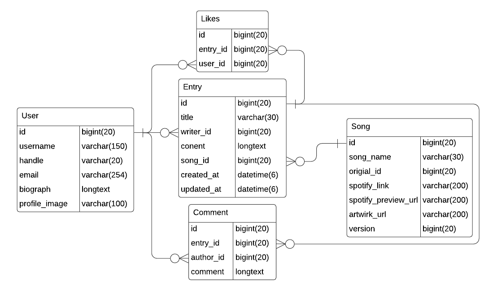
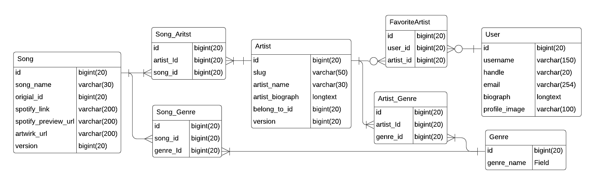
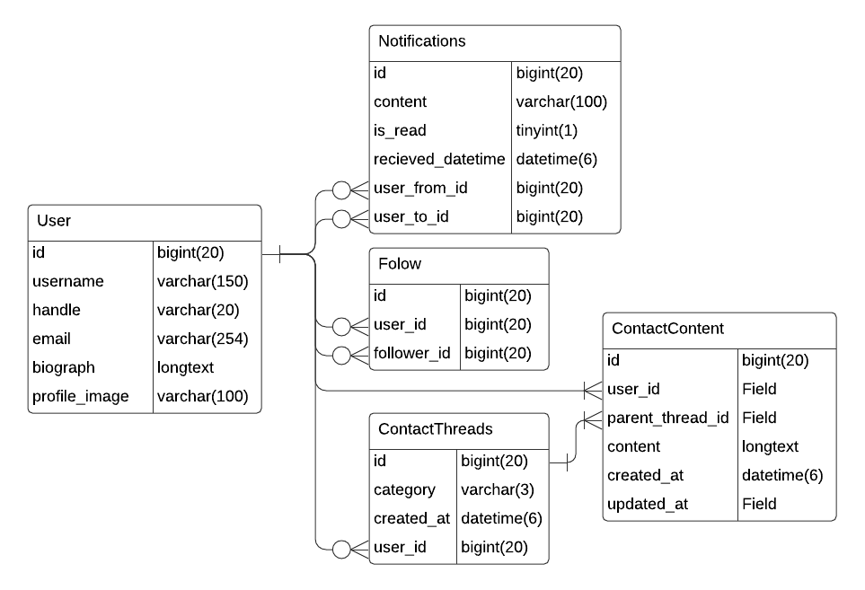

# mlog (読み：エムログ)

    
    
    
    

 

    

 

# 概要

**音楽コンテンツ専用ブログサービス**です。

曲に対して考えたことや感じたこと、裏話等を共有することができます。

曲のどの部分が好きなのか、どんな思い出があるのか、どんな時に聴きたくなるのか、リリックに対してどう考えたのか、
何でもあなたの好きなことを綴ってください。

30秒プレビュー機能を使って読者に曲を聴いてもらうこともできます。

また、同じ曲に対して他の人はどんな風に感じているのか等、様々な方向性から記事にアクセスすることができます。

 

[https://mlog.tamaribuchi-yuki.com/login_as_sample_user/](https://mlog.tamaribuchi-yuki.com/login_as_sample_user/) 

上記URLは、通常はアンデプロイしているため接続できません。ご確認の際は、Twitterアカウント等に連絡をいだだければデプロイいたします。

また、サンプルユーザで自動ログインされるようにしています。

ログアウトした際に、再度ログインするには上記URLからアクセスするか、
下記のユーザネームとパスワードでログインしてください。

    ユーザネーム: sampleuser

    パスワード: passw0rd

  

# 主要機能

- 新規登録 / ログイン / ログアウト / パスワード変更 / パスワードリセット / アカウント停止
- 記事投稿・閲覧・編集・削除
- ジャンル、アーティスト、曲の情報を登録、編集
- 記事と曲の関連付け
- タイムライン機能

 

# その他機能

## ユーザアカウント関連

- ユーザプロフィール登録・編集
- プロフィール写真登録・変更
- フォロー機能

## 記事関連

- ページネーション
- 記事へのコメント投稿・一覧表示・編集・削除
- 記事へのライクを付ける機能、ライクを解除する機能

## 音楽コンテンツ関連

- 曲・アーティスト詳細ページ
- お気に入りアーティスト登録・解除
- Spotify APIを用いたSpotifyリンクURL取得・アートワークURL取得・30秒プレビュー音源URL取得機能

## 全体

- 検索機能(アーティスト・曲・ユーザ)
- お問い合わせ
- 通知機能(記事へのライク・フォロー等)
- i18n(日本語と英語、一部)

  

# 工夫した点

## DRYの原則

### クラス内での対応

クラス継承を用いることでコードの重複を解消。
[実例](https://github.com/yuki-tamaribuchi/mlog_project/blob/c2f1667dfa5aeec1c0a2db06dfda493bd384cc92/mlog_project/search/views.py#L8-L61)

### HTMLテンプレート内での対応

オブジェクトの有無で表示を切り替えることで、記事の新規投稿フォームと更新フォーム等を統合。[実例](https://github.com/yuki-tamaribuchi/mlog_project/blob/c2f1667dfa5aeec1c0a2db06dfda493bd384cc92/mlog_project/templates/entry/entry_form.html#L3)

 

## N+1問題解消

一対多や多対多関係で紐付いているデータを一括でSELECTすることでデータベースの読み出し回数を軽減。
[実例](https://github.com/yuki-tamaribuchi/mlog_project/blob/c2f1667dfa5aeec1c0a2db06dfda493bd384cc92/mlog_project/mlog/views.py#L52-L62)

 

## 楽観的排他制御

複数人が同時に編集する可能性があるモデルをバージョンで管理。
[実例](https://github.com/yuki-tamaribuchi/mlog_project/blob/c2f1667dfa5aeec1c0a2db06dfda493bd384cc92/mlog_project/musics/models.py#L19)

 

## トランザクション処理

2つのモデルを同時に作成する際、片方のみが作成されるのを防ぐ。
[実例](https://github.com/yuki-tamaribuchi/mlog_project/blob/c2f1667dfa5aeec1c0a2db06dfda493bd384cc92/mlog_project/contacts/views.py#L21-L32)

 

## 非同期処理

Celery(タスクキュー)を用いて非同期化。

- [実例(通知の発行処理)](https://github.com/yuki-tamaribuchi/mlog_project/blob/c2f1667dfa5aeec1c0a2db06dfda493bd384cc92/mlog_project/notifications/tasks.py#L7-L24)
- [実例(フォロー通知の発行呼び出し)](https://github.com/yuki-tamaribuchi/mlog_project/blob/c2f1667dfa5aeec1c0a2db06dfda493bd384cc92/mlog_project/follow/views.py#L26-L30)
- [実例(通知の既読処理)](https://github.com/yuki-tamaribuchi/mlog_project/blob/c2f1667dfa5aeec1c0a2db06dfda493bd384cc92/mlog_project/notifications/tasks.py#L27-L31)

 

## ajax

フォロー処理を非同期通信で呼び出し、フォローボタンの表示を変更等
- [実例(テンプレートのフォローボタンの実装)](https://github.com/yuki-tamaribuchi/mlog_project/blob/c2f1667dfa5aeec1c0a2db06dfda493bd384cc92/mlog_project/templates/accounts/user_detail.html#L23)
- [実例(javascriptの実装)](https://github.com/yuki-tamaribuchi/mlog_project/blob/c2f1667dfa5aeec1c0a2db06dfda493bd384cc92/mlog_project/static/js/follow_handler.js)
- [実例(viewsの実装)](https://github.com/yuki-tamaribuchi/mlog_project/blob/c2f1667dfa5aeec1c0a2db06dfda493bd384cc92/mlog_project/follow/views.py#L12-L39)

 

## Content-Security-Policyによるセキュリティ強化

script-srcやimg-srcなどに対するドメインによる制限
[実例](https://github.com/yuki-tamaribuchi/mlog_project/blob/c2f1667dfa5aeec1c0a2db06dfda493bd384cc92/mlog_project/mlog_project/settings_csp.py)

 

## セレクトボックスへの検索機能追加

Select2を用いて検索機能を実現
[実例](https://github.com/yuki-tamaribuchi/mlog_project/blob/c2f1667dfa5aeec1c0a2db06dfda493bd384cc92/mlog_project/entry/forms.py#L8-L21)

記事投稿画面で曲を検索している例

  

# 使用技術

## 言語・フレームワーク

- Python 3.9.9 (開発環境)
- Python 3.8 (本番環境)
- Django 3.2.4

## ミドルウェア

### RDB

- MariaDB 5.1 (開発環境)
- MySQL 8.0.23 (本番環境)

### Webサーバ

- Nginx 1.2

### NoSQL

- Redis 6.2

## インフラストラクチャ

### AWS

- VPC
- RDS
- Route53
- SES
- S3
- Cloudfront
- ElastiCache
- ECR
- ECS
- Fargate
- Cloudformation
- CloudWatch
- Certificate Manager
- Systems Manager (Parameter Store)

## コンテナ技術

- Docker 20.10.8
- docker-compose 1.29.2
- docker hub

## VCS

- git
- GitHub

## その他使用技術

- ajax

- Select2
- Celery
- Spotify API
- Circle CI
- GNU gettext

  

# テスト

## ユニットテスト

### urls

- 任意のurlにアクセスした時に意図したviewクラスが呼び出されるか

### views

- 任意のviewクラスにアクセスした時に意図したテンプレートが使用されているか
- 任意のviewクラスのレスポンスに意図したコンテクストが含まれているか
- 任意の不正なリクエストをした場合に適切なエラーハンドリングがされるか

### models

- 任意のmodelのフィールドの最大字数が意図した字数になっているか
- インスタンスのstrメソッドの戻り値が意図したものになっているか

 

## E2E・UIテスト
未実装

  

# ダイアグラム

## アーキテクチャ

※セキュリティグループは省略しております。

 

## データベースERD

### エントリ関連

### 音楽コンテンツ関連

### その他(通知・フォロー・お問い合わせ関連)

  

# 制作について

## 製作期間

2021年6月14日から現在

 

## 途中経過

2021年6月27日: アプリが一枚岩化していたため分離作業

2021年7月8日: docker / docker-compose導入

2021年8月6日: CSP設定

2021年8月22日: N+1問題対策

2021年8月31日: i18n対応開始

2021年9月6日: AWS ECSへのデプロイ環境構築開始

2021年9月7日: AWS S3対応

2021年9月8日: AWS SES対応

2021年9月11日: AWS RDS対応

2021年9月14日: AWS ECS fargateへのデプロイ環境構築完了

2021年9月23日: AWS Cloudformationを用いたFargateへのデプロイ環境構築開始

2021年10月8日: AWS Cloudformationを用いたFargateへのデプロイ環境構築完了

2021年10月17日: HTTPS対応

2021年10月18日: Circle CI整備完了(テスト・dockerイメージのbuildとpush)